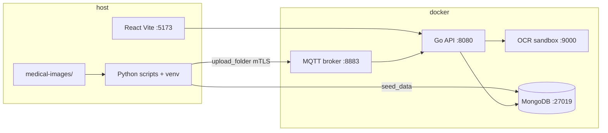

# Build and Run — SS-project

Step-by-step guide for running the medical imaging / MQTT streaming stack locally on Ubuntu Linux.

## What this project is

| Layer | Technology | Role |
|-------|------------|------|
| Frontend | React + Vite (`client/`) | Web UI (photos, devices, reports, auth) |
| API | Go (`server/`) | REST API, JWT auth, MongoDB, MQTT subscriber |
| Broker | Eclipse Mosquitto | mTLS MQTT on port **8883** |
| Database | MongoDB | Port **27019** (host) → 27017 (container) |
| OCR | FastAPI sandbox (`ocr-sandbox/`) | Isolated OCR for medical forms |
| Scripts | Python (`scripts/`, `venv/`) | Seed DB, upload images via MQTT |

Default URLs after a full start:

- Frontend: http://127.0.0.1:5173
- API: http://localhost:8080

---

## Prerequisites

Install on the host:

1. **Docker** (Compose v2). On Ubuntu, Snap Docker is common; you need permission to talk to the daemon (`sudo docker …` or membership in the `docker` group).
2. **OpenSSL** — certificate generation (`scripts/gen-certs.sh`).
3. **Python 3.12+** — virtualenv for scripts.
4. **Node.js 18+** and npm **or** Yarn — frontend (`client/`).

Optional: `wget` or `curl` for downloading portable Node if apt is slow.

---

## One-time setup

### 1. Clone and enter the repo

```bash
cd ~/Documents/SS-project   # or your clone path
```

### 2. Create `.env`

Copy the example and set your Linux user IDs (required for container file permissions):

```bash
cp .env.example .env
id -u   # put in UID=
id -g   # put in GID=
```

`MONGO_INITDB_ROOT_PASSWORD` must match what you use in seed scripts (`scripts/seed_data.py` defaults to `supersecret` if you keep the example values).

### 3. Generate mTLS certificates

```bash
bash scripts/gen-certs.sh
```

Creates `secrets/` (`ca.crt`, `server.crt`, `web.crt`, keys). This folder is gitignored.

### 4. Python virtual environment (local only — do not commit)

```bash
python3 -m venv venv
source venv/bin/activate
pip install -r scripts/requirements.txt
```

`venv/` is listed in `.gitignore` and must **never** be pushed to GitHub.

### 5. Frontend dependencies

With npm:

```bash
cd client
npm install
cd ..
```

With Yarn (as in `scripts/dev-start.sh`):

```bash
cd client
yarn install
cd ..
```

### 6. Uploads directory

Docker bind-mounts `./uploads` into the API. Ensure your user can write there:

```bash
mkdir -p uploads/photos
# If Docker created uploads as root:
sudo chown -R "$(id -u):$(id -g)" uploads
```

---

## Start the backend (Docker)

From the repository root:

```bash
export HOST_IP=$(hostname -I | awk '{print $1}')
```

If Docker requires sudo (common with Snap):

```bash
sudo -E docker compose up -d --build
```

Wait until containers are up:

```bash
sudo docker ps
```

You should see: `mongo-db`, `broker`, `ocr-sandbox`, `go-api`.

### Snap Docker + OCR sandbox

On some Snap Docker setups, the hardened OCR container cannot start (`operation not permitted`). Use the optional local override:

```bash
sudo -E docker compose -f docker-compose.yml -f docker-compose.local.yml up -d --build
```

`docker-compose.local.yml` relaxes sandbox restrictions and runs uvicorn as `python -m uvicorn` (also fixed in `ocr-sandbox/Dockerfile` for future builds).

---

## Seed data (medical records + images)

Activate the venv first:

```bash
source venv/bin/activate
```

### A. Synthetic medical records in MongoDB

Inserts ~50 Romanian medical control records for reports and UI testing:

```bash
python scripts/seed_data.py
```

Expect: `Inserted 50 records!`

### B. Real images from `medical-images/`

Requires the stack running and certificates in `secrets/`.

```bash
python scripts/upload_folder.py
# or:
python scripts/upload_folder.py medical-images --device-id medical-scanner-1
```

Default folder: `medical-images/` (PNG/JPG/JPEG). Images are sent over mTLS MQTT to topic `ssproject/images/<device-id>`, processed by OCR, and stored under `uploads/photos/`.

Single test image:

```bash
python scripts/send_image.py path/to/image.jpg
```

---

## Start the frontend

### Option A — helper scripts

```bash
./start.sh
# or
./scripts/dev-start.sh
```

Requires `yarn` and a existing `.env`. Starts Docker (if not already up) and Vite on **5173**.

Stop everything:

```bash
./scripts/dev-stop.sh
```

### Option B — manual (npm)

```bash
cd client
CHOKIDAR_USEPOLLING=true npm run dev:poll -- --host 127.0.0.1 --port 5173
```

Logs (if started in background): `.dev-runtime/client.log`

---

## Verify everything works

1. **Containers**: `sudo docker ps` — all four services running; `ocr-sandbox` healthy.
2. **API logs**: `sudo docker logs go-api` — should show `Connected to MongoDB!` and `Starting HTTP server on port 8080...`
3. **Frontend**: open http://127.0.0.1:5173 — register/login, open Photos and Reports.
4. **Seed count**: after `seed_data.py`, reports/statistics should show data.
5. **Uploaded image**: after `upload_folder.py`, check `uploads/photos/` and the Photos page.

---

## Git / GitHub notes

| Path | Commit? |
|------|---------|
| `venv/` | **No** — local Python env |
| `.env` | **No** — secrets and local IDs |
| `secrets/` | **No** — TLS keys |
| `uploads/` | **No** — runtime files |
| `.dev-runtime/` | **No** — PIDs and logs |
| `docker-compose.local.yml` | Optional local override (gitignored if you customize) |
| `.env.example` | **Yes** — template only |

---

## Troubleshooting

| Problem | What to do |
|---------|------------|
| `permission denied` on `docker.sock` | Use `sudo docker …` or add your user to the `docker` group and re-login |
| Container name already in use | `sudo docker rm -f mongo-db broker go-api ocr-sandbox` then `compose up` again |
| `Missing .env` | Create from `.env.example` |
| `seed_data.py` connection error | Ensure `mongo-db` is up on port **27019**; password matches `.env` |
| MQTT upload fails | Run `gen-certs.sh`; broker on **8883**; stack running |
| OCR / `ocr-sandbox` restarting | Use `docker-compose.local.yml` (Snap Docker); check `sudo docker logs ocr-sandbox` |
| `mkdir uploads: permission denied` | `sudo chown -R $(id -u):$(id -g) uploads` |
| Frontend: `yarn` not found | Use `npm install` / `npm run dev:poll` in `client/` |

---

## Quick reference (copy-paste)

```bash
# One-time
cp .env.example .env    # edit UID/GID
bash scripts/gen-certs.sh
python3 -m venv venv && source venv/bin/activate && pip install -r scripts/requirements.txt
cd client && npm install && cd ..

# Run backend
export HOST_IP=$(hostname -I | awk '{print $1}')
sudo -E docker compose -f docker-compose.yml -f docker-compose.local.yml up -d --build

# Seed
source venv/bin/activate
python scripts/seed_data.py
python scripts/upload_folder.py

# Frontend
cd client && npm run dev:poll -- --host 127.0.0.1 --port 5173
```

---

## Architecture (high level)


